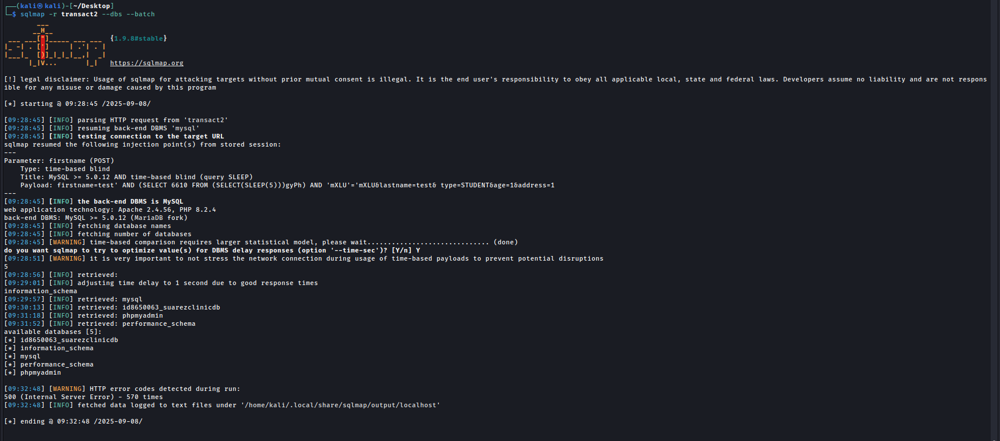
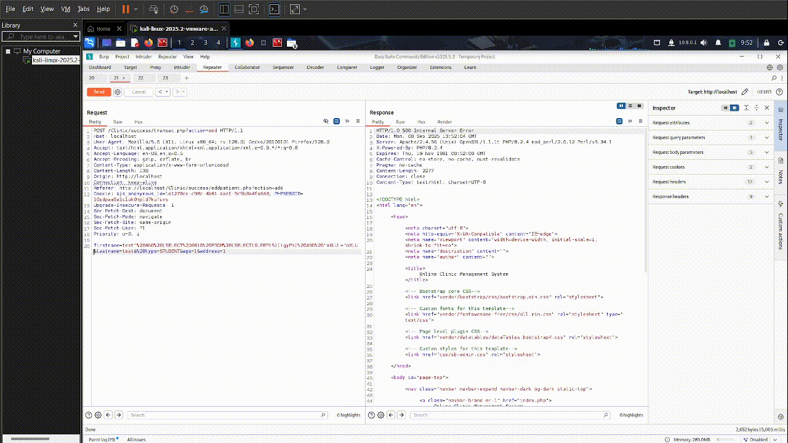
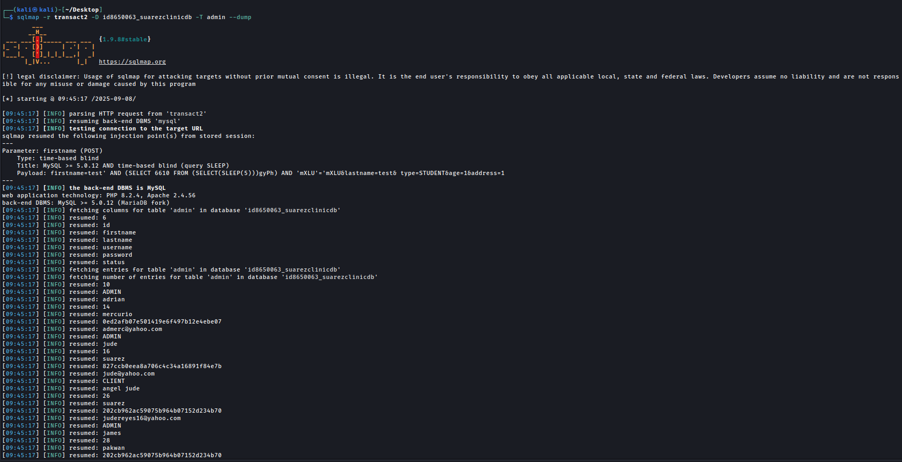

# Online-Clinic-Management-System Time-Based Blind SQLi PoC

|             | Details |
|-------------------|---------|
| **Vulnerability Type** | Time-Based Blind SQL Injection |
| **Affected File** | `transact.php` |
| **Parameter** | `firstname (POST)` |
| **Vendor** | [itsourcecode](https://itsourcecode.com/) |
| **Product** | [Online Clinic Management System v1](https://itsourcecode.com/free-projects/php-project/online-clinic-management-system-php-projects-source-code/) |
| **Softlink** | https://itsourcecode.com/free-projects/php-project/online-clinic-management-system-php-projects-source-code/ |

### Summary
-  The Online Clinic Management System is vulnerable to time-based blind SQL Injection in the ``transact.php`` script. This flaw enables attackers to manipulate SQL queries and exfiltrate sensitive data (e.g., administrative credentials), which can lead to complete system compromise.


### Vulnerable Code
```php
$query = "INSERT INTO patients
(fname, lname, patient_type, age, address)
VALUES ('".$fname."','".$lname."','".$type."','".$age."','".$address."')";
mysqli_query($db,$query) or die ('Error in updating Database');
```
-  **Root Cause:** User input ``($_POST parameters)`` is inserted directly into SQL queries without parameterization.
-  **Affected Parameter:** ``firstname (POST)``

**Evidence:** *sqlmap output*



---

### Proof of Concept
### 1. Request in Burp
-    A normal add of patient attempt was intercepted with Burp Suite.
-    The raw request was saved into a file for sqlmap testing.
  


### 2. ``sqlmap`` dump
-   Run sqlmap using the Burp request file
-   sqlmap confirmed the injection point.



---

## Result:
-  The server delayed its response by 5 seconds, confirming successful time-based injection.
-  Sqlmap was able to enumerate the database ``(id8650063_suarezclinicdb)`` and dump the useraccounts table.
